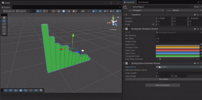

# Soobak Algorithm Core & Sorting
[](https://github.com/soo-bak/soobak-algo-core/actions/workflows/unity-editmode.yml)
[](https://gist.github.com/soo-bak/21437d3f33ae019a0b58a88a2bf90c56)
[](https://github.com/soo-bak/soobak-algo-core/commits)


Reusable Unity 6 algorithm pipeline. `com.soobak.algo.core` defines execution primitives, while `com.soobak.algo.sorting` and `com.soobak.algo.search` ship domain-specific showcases.

## Architecture Layers
- **Core Primitives**: `IAlgorithm<TState, TEvent>` and `IAlgorithmStepSink<TState, TEvent>` contracts with `AlgorithmRunner<TState, TEvent>` handling snapshot cloning and fan-out.
- **Core Pipeline**: `IAlgorithmDescriptor<TState, TEvent>`, `IAlgorithmCatalog<TState, TEvent>`, and `AlgorithmPipeline<TState, TEvent>` model how algorithms are registered, discovered, and executed.
- **Sorting Module**: `SortingState`/`SortingItem`, `SortOp`, `IBarVisualizer`, `SortingAlgorithmCatalog`, and `SortingRunner` demonstrate the pipeline with bubble, selection, merge, heap, shell, counting, quick, and stable insertion sort implementations.
- **Search Module**: `SearchState`/`SearchResult`, `SearchEvent`, `ISearchAlgorithm`, and search-specific implementations for linear search, binary search, and other search algorithms.

## Execution Flow
1. `SortingAlgorithmCatalog` exposes descriptors created via `AlgorithmDescriptor.Create`.
2. `SortingRunner` composes visualizers (`IBarVisualizer`) and, when supplied, the catalog to build an `AlgorithmPipeline`.
3. Consumers either pass an `ISortingAlgorithm` directly or call `ExecuteAsync("quick-sort", state, token)`.
4. Each step broadcasts a cloned `SortingState` and a `SortOp` event so visualizers receive immutable snapshots.

## Usage
1. Add Git UPM dependencies using path parameters.
   ```json
   {
     "dependencies": {
       "com.soobak.algo.core": "https://github.com/soo-bak/soobak-algo-core.git?path=Packages/com.soobak.algo.core",
       "com.soobak.algo.sorting": "https://github.com/soo-bak/soobak-algo-core.git?path=Packages/com.soobak.algo.sorting",
       "com.soobak.algo.search": "https://github.com/soo-bak/soobak-algo-core.git?path=Packages/com.soobak.algo.search"
     }
   }
   ```
2. Implement a visualizer.
   ```csharp
   public sealed class BarVisualizer : IBarVisualizer {
     public UniTask InitializeAsync(SortingState initialState, CancellationToken token) => UniTask.CompletedTask;
     public UniTask PublishAsync(AlgorithmStep<SortingState, SortOp> step, CancellationToken token) => UniTask.CompletedTask;
     public UniTask CompleteAsync(SortingState finalState, CancellationToken token) => UniTask.CompletedTask;
   }
   ```
3. Run an algorithm via descriptor.
   ```csharp
   var catalog = new SortingAlgorithmCatalog();
   var runner = new SortingRunner(new BarVisualizer(), catalog);
   var state = SortingState.FromValues(new[] { 4, 2, 3, 1 });
   var sorted = await runner.ExecuteAsync("quick-sort", state, CancellationToken.None);
   ```

## Testing Philosophy
- Cover pure logic with Unity EditMode tests; use `UniTask` and log cancellations/errors via `Debug` in English.
- Sample command: `Unity.exe -projectPath . -runTests -testPlatform editmode -logFile ./Artifacts/editmode.log`

## Continuous Integration
- `.github/workflows/unity-editmode.yml` runs EditMode suites through `game-ci/unity-test-runner@v4`.
- `.github/workflows/commit-sentinel.yml` enforces SSH-signed commits and the `:gitmoji: scope: message` style.

## Samples
- Import "Sorting Visualizer Demo" from the Package Manager samples to try the cube-based bar visualizer.
- Attach `SortingDemoController` to an empty GameObject and press Play to run the selected algorithm.



## Additional Docs
- See `Docs/architecture.md` for layering responsibilities and extension guidance.

## Roadmap
- Extend the catalog with additional algorithms (e.g., counting sort, shell sort).
- Spin up new domain packages (e.g., graph search) that reuse the core pipeline.
- Validate Git UPM consumption from a demo repository with WebGL publishing.
